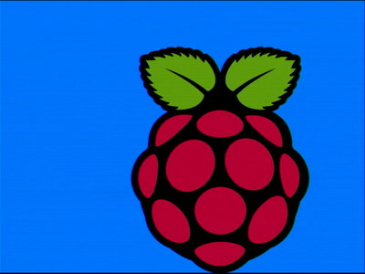
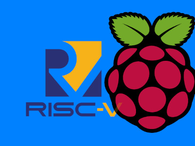
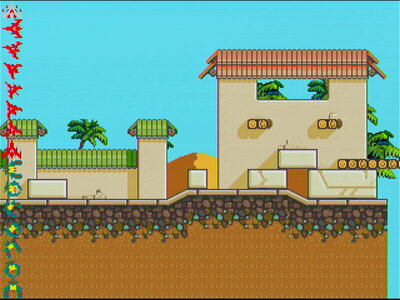
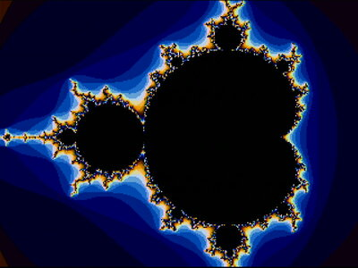
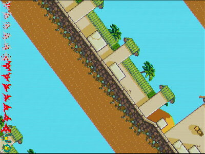
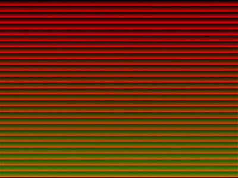
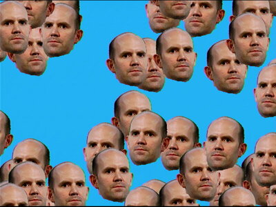
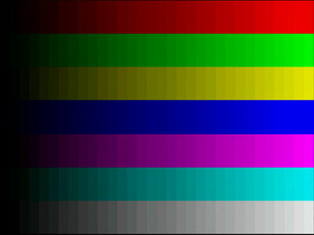
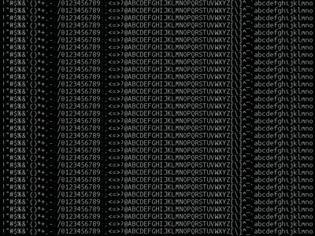

This repo is similar to [pico-examples](https://github.com/raspberrypi/pico-examples) but utilizing additional libraries
from [pico-extras](https://github.com/raspberrypi/pico-extras)

Note that most of these examples are neither fleshed out nor well documented. They mostly serve
the purpose of playing with/testing particular areas of functionality (mostly audio/video related)

Finally, you may wonder why many of these demos set the system clock to 48Mhz. The reason is that until we had physical
chips, we were running at a fixed 48Mhz system clock using an FPGA. Most of these examples were written before the 
RP2040 design was final, so they were all developed with that fixed 48MHz system clock. As a result some of the examples do things in a way 
that you wouldn't necessarily need to if you had more clock speed available (which you do), but on the plus side,
you have that much more time to do even more things!

## Full Applications

Name|Description 
---|---
[popcorn](apps/popcorn)| This is a movie player for 30fps 320x240 movies with 44100 stereo sound, read in a custom format from SD card... it can even play backwards :-) Sample movie file linked from [here](apps/popcorn/README.md).
[usb_sound_card](apps/usb_sound_card)| A no frills but functional USB sound card... hooked up via our old (pre TinyUSB) USB device stack. Keeping it around as it works nicely!

## Audio

Name|Description
---|---
[sine_wave_i2s](audio/sine_wave)| A simple sine wave audio output using I2S.
[sine_wave_pwm](audio/sine_wave)| A simple sine wave audio output using PWM.
[sine_wave_spdif](audio/sine_wave)| A simple sine wave audio output using S/PDIF.

## Scanout Video

In _scanout_ video, every pixel is driven by the PIO every frame, and a framebuffer is not (necessarily) used (which
is useful when you only have 264K of RAM).

For a fuller description of scanout video see [here](https://github.com/raspberrypi/pico-extras/blob/master/src/common/pico_scanvideo/README.adoc)

Name| Screenshot                                      |Description
---|-------------------------------------------------|---
[demo1](scanvideo/demo1)|              | So named because it was the first demo program written that used video.. it is a bit dated now and hails from a time where there was _much_ less RAM on the RP2040
[demo2](scanvideo/demo2)|              | A little variation on `demo1` for RP2350. Displays a RISC-V logo also; if built for RISC-V the RISC-V logo is in front; if built for Arm, it is behind
[flash_stream](scanvideo/flash_stream)|       | Streams video data out of flash fast enough to drive 640x480x60fps bitmap display
[hscroll_dma_tiles](scanvideo/hscroll_dma_tiles)|  | A horizontal scrolling test app which uses a second video plane (PIO) to overlay sprites
[mandelbrot](scanvideo/mandelbrot)|         | A mandelbrot generator using a 320x240x16 framebuffer
[mario_tiles](scanvideo/mario_tiles)|        | Confusingly named as a reference to Super Mario Kart's tiled psuedo-3D rendering. This is similar to [hscroll_dma_tiles](scanvideo/hscroll_dma_tiles) except the whole tiled scrolling area is now rotated and zoomed.
[scanvideo_minimal](scanvideo/scanvideo_minimal)|  | A very basic video output generator which generates a test pattern
[render](scanvideo/render)|                                                 | A very dated rendering library used by [demo1](scanvideo/demo1) - avoid!
[sprite](scanvideo/sprite)|                                                 | A small sprite library used by [sprite_demo](scanvideo/scanvideo_minimal)
[sprite_demo](scanvideo/sprite_demo)|        | Some bouncing Eben heads
[test_pattern](scanvideo/test_pattern)|       | Display color bars
[textmode](scanvideo/textmode)|           | Shows off chained DMA to generate scanlines out of glyph fragments via DMA/PIO

The above are intended to be used with the VGA demo board as described in [Hardware Design with RP2040](https://rptl.io/rp2040-design) however it is possible to wire your own VGA output according to the following schematic:

## Sleep

Examples of using low power mode; these use `pico_sleep` from pico_extras which is not yet stable.

Name|Description
---|---
[hello_dormant](sleep/hello_dormant)| Demonstrates dormant mode
[hello_sleep](sleep/hello_sleep)| Demonstrates low power sleep and waking from RTC

## Stdio

Examples of adding additional stdio support. Note the interface for stdio drivers is not yet considered stable
even though it is in the Pico SDK

Name|Description
---|---
[stdio_pio](stdio/pio)| Demonstrates adding a custom STDIO driver using a PIO UART
